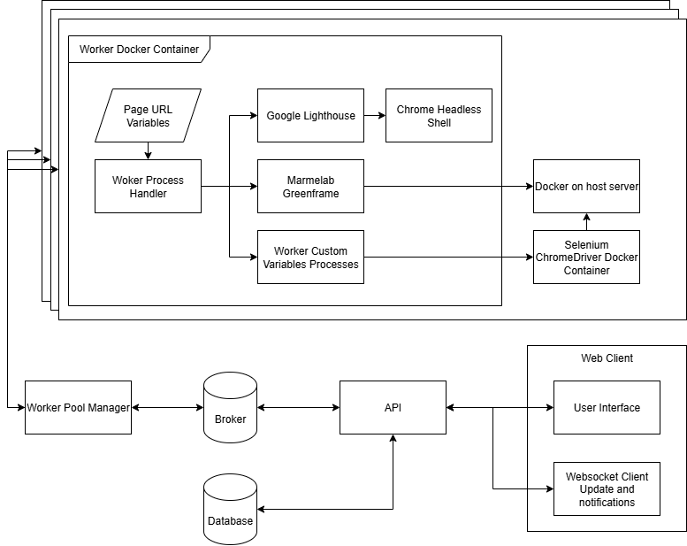
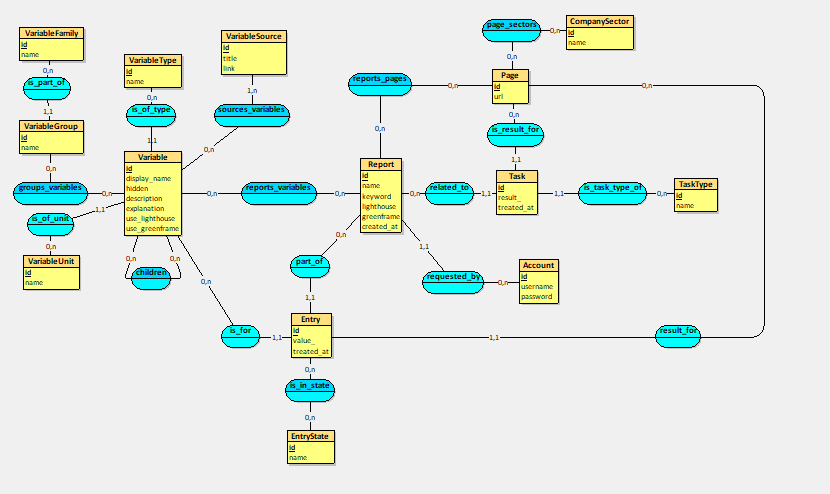

+++
title = "Compétence 1 - Réaliser un développement d'application"
+++

Cette section est dédiée à la présentation du travail réalisé correspondant à la compétence 1 lors de l'alternance à l'ESTA.

## Présentation de la compétence et des apprentissages critiques

Cette compétence se centre sur la réalisation et le développement d'applications.

|Composantes|AC 1|AC 2|AC 3|AC 4|
|---|---|---|---|---|
|Développer des applications informatiques simples|Implémenter des conceptions simples|Élaborer des conceptions simples|Faire des essais et évaluer leurs résultats en regard des spécifications|Développer des interfaces utilisateurs|
|Partir des exigences et aller jusqu'à une application complète|Élaborer et implémenter les spécifications fonctionnelles et non fonctionnelles à partir des exigences|Appliquer des principes d'accessibilité et d'ergonomie|Adopter de bonnes pratiques de conception et de programmation|Vérifier et valider la qualité de l'application par les tests|
|Adapter des applications sur un ensemble de supports|Choisir et implémenter les architectures adaptées|Faire évoluer une application existante|Intégrer des solutions dans un environnement de production|

## Présentation de l'application

Tout d'abord, il est important de connaître l'application qui a été développée et le but de sa création. L'application
réalisée est un outil d'analyse multi-critères de pages web, son objectif est la récupération de données relatives à
la culturalization, au référencement et à l'éco conception web. Pour ce faire, l'application utilise un scraper permettant de
naviguer et de récupérer les données voulues ou de les calculer à partir d'éléments présents sur les pages analysées.
L'application est une évolution mais aussi une reprise à zéro d'anciens projets qui ont été développés dans le cadre des recherches de
M. SAGOT, enseignant-chercheur et directeur de la recherche à l'ESTA, qui a été mon tuteur durant cette alternance.

L'application a été développée en respectant les indications de M. SAGOT concernant ses fonctionnalités, mais aussi les contraintes liées
à celle-ci.

Dans les fonctionnalités importantes, nous avions :
- Un système d'authentification simple
- Une capacité d'analyse de pages web assez importante
- Une liste de critères fiables et s'inscrivant dans une démarche scientifique
- Une application avec client web responsive
- Un panel d'administration simple et intuitif
- Une application maintenable sur le long terme
- Une historisation des valeurs d'une page pour pouvoir les comparer à travers le temps

## Architecture de l'application

Dans le but de pouvoir avoir une application maintenable et fiable sur le long terme, il a été important de réfléchir à la manière de
décomposer celle-ci. Ce qui m'amène à vous présenter la première illustration de ce portfolio.

|**Illustration 1 : Architecture logicielle d'Holistic Analytica**|
|---|

### Description de l'illustration

Commençons par décrire cette illustration et donc l'architecture de l'application. L'application est décomposée en trois parties :
- L'interface utilisateur
- L'API et la gestion des workers
- Les workers permettant l'analyse des pages

Dans cette section concernant la compétence 1, nous ne nous focaliserons pas sur la distribution des workers et les optimisations et
contraintes liées à ceux-ci, nous en parlerons plus amplement dans la section concernant la [compétence 2](/competence2/).

Pour en revenir à la description de l'illustration, nous avons l'interface utilisateur qui permet les interactions avec l'API, notamment
pour la création des rapports d'analyses qui sont le regroupement d'une liste de pages et de critères à analyser, mais aussi la
visualisation des données obtenues et ce même pendant que l'analyse est en progression. Nous pouvons aussi remarquer la présence d'une
relation bidirectionnelle entre l'API et l'interface, cette relation est produite par la présence d'un websocket permettant la mise en
place d'un système de notifications pour obtenir les mises à jour concernant la progression des rapports sur une page dédiée.

L'API a deux bases de données qui lui sont liées, la première est une base de données relationnelle classique permettant le stockage des
données permettant le bon fonctionnement de l'outil. La deuxième base de données sert de "Message Broker", c'est une file de messages pour
permettre l'ordonnancement des tâches pour les workers, lorsqu'un rapport est créé, un ensemble de tâches est ajouté à la file de messages.
Cette file de messages est accessible par n'importe quel worker qui, par l'intermédiaire d'un outil d'ordonnancement, va pouvoir prendre une
tâche en attente (une tâche est une page à analyser suivant une liste de critères définie) et commencer l'analyse avant de retourner ses
résultats dans la file de messages du "Message Broker". Les résultats retournés sont ensuite stockés dans la base de données principale
avant d'être décortiqués pour obtenir les différentes entrées correspondant aux différentes valeurs de chaque critère.

### Implémentation et travail effectué

Maintenant que l'architecture a été décrite de manière succincte, il est temps de passer à la partie implémentation de celle-ci.

Pour commencer, nous allons aborder la partie interface utilisateur, qui se décompose en deux interfaces distinctes. La première est
l'interface de l'outil, celle permettant la création de rapports et leur suivi. La deuxième est l'interface d'administration permettant
la gestion des données de l'outil.

L'interface de l'outil a été développée en utilisant Nuxt et NuxtUI (bibliothèque de composants graphiques pour Nuxt), l'intérêt de ce
choix est multiple. Tout d'abord, Nuxt ressemble à VueJS, mais à plusieurs abstractions et éléments présents pour faciliter le
développement d'interface web, mais il se différencie sur la présence de rendu côté serveur ou Server Side Rendering (SSR), ce qui
permet d'alléger une partie du rendu du côté client en rendant ce qui peut l'être du côté serveur. L'intérêt de l'utilisation de
NuxtUI a été de pouvoir avoir un panel de composants responsives pour ne pas perdre trop de temps à développer l'interface qui n'est pas
la plus grande priorité de cette alternance. Il est important de souligner que VueJS avait été utilisé pour débuter le développement de
cette interface, mais a été abandonné au profit de Nuxt, car certaines bibliothèques employées ne fonctionnaient pas ou mal avec VueJS.

L'interface administrateur a d'abord été développée en utilisant VueJS aussi, cependant, à la suite de changements de technologies du
côté de l'API, j'ai pu me permettre d'exploiter l'interface d'administration de Django directement, elle permet énormément d'opérations
sur les données de l'outil, mais elle est aussi dotée d'une flexibilité et d'un niveau de personnalisation assez conséquents.

Ensuite, maintenant que nous avons parlé de l'interface et introduit Django, il est temps de discuter de l'implémentation du Backend et de
l'API. Dans cette partie, nous allons omettre ce qui concerne les workers qui seront développés dans la [compétence 2](/competence2/).

L'API a connu un développement en deux temps causé par un changement technologique durant son développement, j'avais tout d'abord
utilisé FastAPI et SQLAlchemy pour développer celle-ci, mais j'ai fait face à de nombreuses contraintes liées à l'utilisation de
ces technologies. Tout d'abord, FastAPI est un cadriciel assez récent, qui permet le développement d'API simple, le cadriciel est en soi
assez complet et permet une grande flexibilité de développement, néanmoins il est par moments trop épuré, voire lacunaire, ce qui m'avait
amené à devoir passer du temps à développer des éléments qui seraient basiques et fondamentaux dans d'autres cadriciels. Une autre raison
qui m'a poussé à choisir de changer les technologies du projet a été SQLAlchemy, SQLAlchemy est une bibliothèque permettant de créer une
abstraction dans les interactions avec la base de données, ce n'est pas pour autant un ORM, mais il s'en approche. Ce que gagne SQLAlchemy en
flexibilité, il le perd en facilité de conception et d'usage, SQLAlchemy se révèle être plus complexe que nécessaire pour certains usages.
Après mûre réflexion et recherche, j'ai décidé d'utiliser Django qui a permis de faciliter une grande partie du développement, grâce à sa
pile technologique très complète. Django est un cadriciel mature et utilisé pour de nombreux projets, il a une structure permettant la
réutilisation de composants, un ORM améliorant grandement la qualité de développement. En l'état, Django ne permet pas la création d'API
REST sans beaucoup d'efforts, cependant il existe de nombreuses bibliothèques permettant d'ajouter cette fonctionnalité, mais aussi tout
l'environnement nécessaire à Django pour réaliser ce type de projet, comme Django Ninja (utilisé pour ce projet) ou Django REST Framework.

Les routes réalisées pour l'API ont été uniquement les routes importantes pour pouvoir réaliser des analyses, les routes CRUD à part pour
certaines n'ont pas été implémentées, une grande partie des besoins en CRUD pour les tables composant l'outil est réalisée par le panel
administrateur présent de base dans Django, sachant que les utilisateurs lambda n'ont pas besoin de pouvoir modifier, supprimer, créer ou
avoir accès à certains éléments, il n'y avait de réelle nécessité à créer ces routes à l'heure actuelle.

Le développement s'est focalisé sur la création de rapports, la création des tâches liées au rapport et la visualisation des rapports.
Pour pouvoir parler plus en détail de cette partie, je vais vous présenter la deuxième illustration concernant cette compétence.

## Modélisation des données

|**Illustration 2 : Modèle conceptuel de données d'Holistic Analytica**|
|---|

Cette illustration représente la modélisation actuelle de la base de données de l'application Holistic Analytica. Il ne serait pas intéressant de
détailler chaque table, mais plutôt de voir les différents ensembles et groupes formés et de les comprendre dans le cadre
de cet outil.

On peut tout d'abord commencer par remarquer la présence de trois groupes importants :
- L'entité Rapport et ses entités liées
- L'entité Variable (les critères) et ses entités liées
- L'entité Page et ses entités liées

Le rapport est composé d'une liste de pages, d'une liste de critères, d'une liste de tâches et d'une liste d'entrées. Les tâches sont les
résultats bruts des analyses effectuées par les workers et elles sont enregistrées pour chaque type de tâche (critères personnalisés,
Lighthouse, Greenframe) et chaque page d'un rapport. Les entrées sont, quant à elles, les valeurs obtenues lors de l'analyse de chaque
critère et reprises depuis le résultat des tâches. Les entrées sont une association entre un rapport, une page, une variable (critère)
et la valeur calculée.

Le groupe relatif à l'entité Page est relativement petit, il est surtout composé de l'entité Page et de l'entité Secteur de l'entreprise, les
raisons de cette modélisation sont dues à l'anticipation de certaines fonctionnalités comme la possibilité de comparer des pages entre
elles en fonction de leurs secteurs d'activité.

L'entité Variable qui correspond à ce que j'appelle critère depuis le début, sert à regrouper toutes les variables utilisées par les
workers pour analyser des pages. Les variables sont regroupées dans des familles (culturalization, référencement web et éco conception) et
en sous-groupes (performance (éco conception), on page (référencement), off page (référencement), etc.). Les variables provenant de la
littérature scientifique, il est important de mettre en place quelque chose permettant l'ajout de sources et d'autres informations
vis-à-vis des variables, c'est pour cela qu'il y a une entité Source de Variable.

L'intérêt premier de modéliser les rapports de cette façon est de pouvoir les découper de manière atomique, avec les rapports pouvant se
résumer à être un ensemble d'entrées. Cette modélisation rend possible la relance individuelle du calcul de critères qui n'aurait pas
abouti, mais aussi de pouvoir accumuler l'évolution de la valeur des différents critères pour une même page, permettant l'historisation
des pages et des valeurs de critères.

## Difficultés rencontrées

Différentes difficultés ont pu être rencontrées durant le développement d'Holistic Analytica, tout d'abord, il y a les problèmes mentionnés
plus haut concernant les raisons des changements de technologies. Dans les autres problèmes, il y a notamment le déploiement de
l'application. L'application étant décomposée en plusieurs parties, le déploiement n'a pas forcément été aisé, en premier lieu, j'ai
commencé par le déploiement de l'API et de l'interface, cela n'a pas été très complexe, mais a quand même nécessité de la réflexion
notamment pour pouvoir trouver un moyen de compiler les éléments statiques, de faire en sorte que certains éléments soient servis via le
reverse proxy/serveur web NGINX, mais aussi de permettre un déploiement facilité de l'interface et de l'API. Le gros des difficultés
rencontrées vient surtout du déploiement des workers, les workers doivent pouvoir être déployés aisément sur n'importe quelle machine et
pouvoir tourner sans soucis et sans phases d'installation ou de paramétrage trop longues. Ce qui a conduit à l'emploi de Docker pour 
réaliser le déploiement comme montré dans l'illustration 1, le déploiement est composé de deux images, la première correspond au worker en 
lui-même avec l'ajout d'outils externes comme Google Lighthouse et Greenframe et la deuxième correspond à l'image d'un web driver de 
Selenium et plus particulièrement d'un Chrome Driver car Google Chrome est le navigateur dominant le marché actuellement.

## Conclusion

Ce projet m'a permis d'explorer différents éléments concernant le développement d'application. J'ai eu l'occasion de reprendre le
développement de zéro, pour pouvoir proposer une application fonctionnelle et plus performante. Il m'a été possible de me baser ou de
réutiliser des éléments d'anciens projets pour le calcul de certains critères. Pour confirmer la cohérence et la fiabilité des valeurs,
des tests et des sites étalons ont pu être utilisés pour corroborer les résultats obtenus pour certains critères. L'interface utilisateur
est quasiment dans son intégralité responsive, il y a quelques problèmes sur certains éléments mais rien d'impossible à corriger.
L'ensemble de l'application est actuellement fonctionnel et déployé sur les serveurs de l'ESTA.
