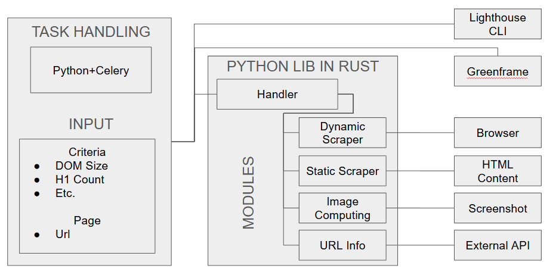
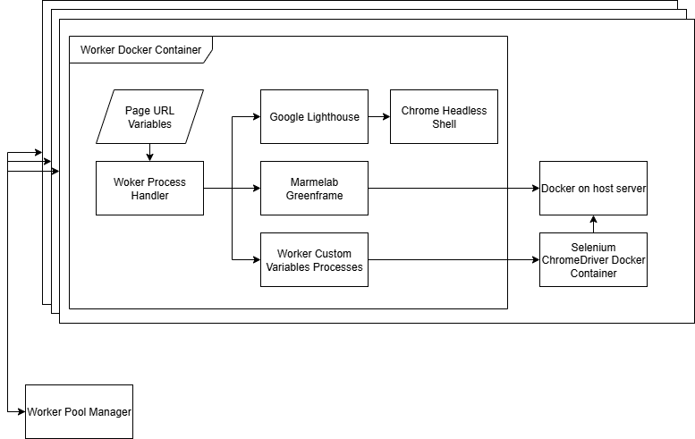
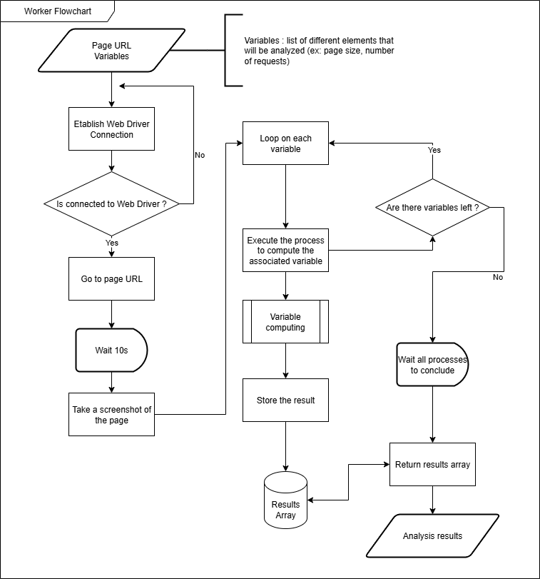

+++
title = "Compétence 2 - Optimiser des applications"
+++

Cette section est dédiée à la présentation du travail réalisé correspondant à la compétence 2 lors de l'alternance à l'ESTA.

## Présentation de la compétence et des apprentissages critiques

Cette compétence se centre sur l'optimisation des applications

|Composantes|AC 1|AC 2|AC 3|AC 4|
|---|---|---|---|---|
|Appréhender et construire des algorithmes|Analyser un problème avec méthode|Comparer des algorithmes pour des problèmes classiques|Formaliser et mettre en oeuvre des outils mathématiques pour l'informatique||
|Sélectionner les algorithmes adéquats pour répondre à un problème donné|Choisir des structures de données complexes adaptées au problème|Utiliser des techniques algorithmiques adaptées pour des problèmes complexes|Comprendre les enjeux et moyens de sécurisation des données et du code|Évaluer l'impact environnemental et sociétal des solution proposées|
|Analyser et optimiser des applications|Anticiper les résultats de divers métriques|Profiler, analyser et justifier le comportement d'un code existant|Choisir et utiliser des bibliothèques et méthodes dédiées au domaine d'application||

## Diviser pour mieux régner : des workers distribués

Pour commencer, si vous voulez un descriptif du projet dans son ensemble, je vous invite à aller voir la section dédiée à la
[compétence 1](/competence1/). Dans cette section, nous allons aborder les aspects liés à l'optimisation que ce soit d'un point de vue
métrique, ou d'un point de vue algorithme.

Comme l'indique le titre de cette partie, nous allons commencer par parler des workers distribués. Déjà, une première question peut se
poser : "Pourquoi faire des workers et pourquoi les distribuer ?". Les raisons sont plutôt simples, tout d'abord, séparer les calculs et
les analyses des pages de l'application principale permet de diminuer la charge sur celle-ci, les serveurs loués par l'ESTA ne permettant
pas une grande charge de calcul, il est important de pouvoir distribuer cette charge ailleurs, d'où la mise en place de workers séparés.

Maintenant, pour répondre à la question de l'aspect distribué de ces workers, je dois d'abord vous expliquer que comme dit précédemment,
l'ESTA avait des contraintes matérielles assez importantes, il n'était pas possible de faire tourner beaucoup d'analyses en parallèle et
la charge était si importante que l'ancien outil (une preuve de concept développée en stage) cessait de fonctionner ou n'arrivait plus
à continuer les analyses. Dû à la charge trop importante, il arrivait que l'ancienne application cause des saturations de la mémoire et
fasse planter le serveur hôte.

En prenant en considération tout cela, j'ai décidé de reprendre le développement de l'application précédente de zéro comme mentionné dans la section
dédiée à la [compétence 1](/competence1/).

Une différence majeure entre l'application actuelle et l'application précédente est la technologie principale utilisée. Dans l'application
précédente qui servait de preuve de concept, pour effectuer les tâches d'analyses, j'ai eu recours à JavaScript et Puppeteer pour le
scraping. A l'époque, par rapport aux contraintes de temps liées au stage, je n'avais eu trop le choix de que de me reposer sur les
technologies précédentes pour développer plus rapidement, cependant, le gain en temps de développement s'est répercuté sur la
maintenabilité, la fiabilité, et les performances globales de l'application.

En ayant tout cela en tête, j'ai décidé de reconsidérer toutes les options disponibles et prendre le temps qu'il faut pour obtenir un
résultat satisfaisant pour l'analyse des pages web. Mon choix s'est porté assez rapidement sur le fait de décomposer le backend entre
l'API pour gérer les données et des workers distribués pour gérer la collecte/analyse de données. Les technologies choisies pour les
workers répondent aux limitations matérielles et aux contraintes d'échelle concernant la quantité de pages et de critères à analyser.
La base des workers a été intégralement faite en Rust, pour voir la pile technologique simplifiée des workers je vous invite à regarder
la trace suivante.


|**Trace 1 : Pile technologique simplifiée des workers**|
|---|

On constate qu'en plus de Rust, on voit la présence de Python dans la gestion des tâches des workers, cela est dû à l'utilisation de
l'outil [Celery](https://docs.celeryq.dev/en/stable) qui permet de faire fonctionner des workers distribués, de gérer des tâches en
parallèle et de gérer l'ordonnancement de l'ensemble des tâches et de workers sans qu'on n'ait besoin de développer une solution propre.

Pour pouvoir appeler des fonctions Rust en Python, j'ai eu besoin de créer un "binding" entre les fonctions Rust et les fonctions Python.
Cela a permis de garder les aspects positifs de Rust (meilleure gestion de la mémoire et temps d'exécution rapide) et de pouvoir garder un
backend avec un écosystème centré autours de Python (l'API étant faite avec Django et donc Python) et donc de pouvoir utiliser le
programme Rust directement depuis Celery. Celery a permis aussi de centraliser tous les types de tâches à effectuer comme les tâches
utilisant Google Lighthouse et les tâches utilisant Greenframe, Celery va détecter quel outil il doit appeler et va lancer un processus
lié à cet outil à retourner le résultat.

Pour simplifier le développement, mais aussi diminuer fortement l'impact du calcul de certains critères, j'ai décidé d'employer
différentes méthodes pour récupérer les informations relatives à un critère ou pour naviguer vers la page à analyser. Tout
d'abord, pour le scraping dynamique, j'ai utilisé ThirtyFour qui est une implémentation de Selenium en Rust. Ensuite, pour le scraping
statique, j'ai utilisé la bibliothèque "scraper", il n'est pas toujours nécessaire d'avoir toutes les fonctionnalités d'un navigateur
ou d'avoir une navigation dynamique pour le calcul de certains critères. Après, j'ai ajouté la bibliothèque "image" et "imageproc"
permettant la manipulation des images car certains critères nécessitent des opérations sur les aspects visuels des pages, on doit donc
prendre une capture d'écran de la page, puis la manipuler et l'analyser. Les opérations liées aux images sont coûteuses, ce qui a
nécessité une réflexion sur la manière d'optimiser à la fois la mémoire utilisée par rapport à ces opérations, mais aussi la complexité
des algorithmes associés.


|**Trace 2 : Architecture distribuée des workers**|
|---|

Cette trace est tirée de la trace 1 de la compétence 1, mais ici, nous nous focalisons sur le côté distribué des workers. Il est important
de noter que la partie liée à l'API et à l'interface utilisateur a été enlevée. On peut d'abord constater des similarités entre cette
trace et la précédente, notamment, sur la gestion des tâches et leur répartition. Il y a néanmoins des informations supplémentaires qui
nous sont données, dans un premier temps, Google Lighthouse nécessite une console sans interface de Chrome pour fonctionner, alors que
dans un second temps, on constate que les workers Rust utilisent un Chrome Driver (contenu dans un conteneur à part) pour fonctionner, ce
qui amène à une duplication de navigateur. Une duplication qui n'a pas pu être éviter car Lighthouse ne pouvait pas fonctionner avec un
web driver directement. Ensuite, on peut remarquer la présence d'un lien entre Greenframe et le programme Docker de la machine, c'est dû
au fonctionnement de Greenframe qui nécessite l'exécution d'un conteneur contenant un navigateur pour récupérer des données de métriques
concernant l'usage des ressources matérielles pour naviguer sur la page à analyser. Le navigateur utilisée par Greenframe ne peut
malheureusement pas servir pour d'autres tâches, sinon cela pourrait fausser les résultats obtenus par Greenframe concernant l'usage
matériel.

La trace 2 montre aussi la présence d'opération en parallèle (la superposition d'éléments multiples en dessous des workers et le fait
que plusieurs flèches sortent du Worker Pool Manager, le gestionnaire des instances de workers), j'ai mentionné plus haut le fait que les
workers ont été pensés pour pouvoir être distribués, l'intérêt est dans un premier temps la diminution de la charge sur les serveurs et
sur l'application principale, mais la capacité de pouvoir changer l'échelle et le nombre de pages analysées en parallèle juste en ajoutant
de nouveaux workers.

Après avoir effectué de nombreuses optimisations en termes de mémoire et d'utilisation du CPU pour les workers, ils sont en capacité de
tourner sur des machines peu performantes avec 4Go de RAM et des processeurs avec une puissance de calcul tout à fait relative. Une des
méthodes d'optimisation principales pour alléger l'impact sur les ressources a été d'employer des spécificités de Rust permettant le fait
de rendre aisément le retour de fonction statique après un premier appel, ce qui fait que les fonctions dépendant d'autres fonctions
utilisent des résultats mis en cache pour éviter de relancer des processus qui peuvent être longs et lourds.

## De l'asynchrone pour gagner en temps

L'un des objectifs premier du travail de cette année a été de minimiser le temps d'analyse pour rapport, pour ce faire, il fallait d'abord
minimiser le temps de calcul d'une page, puis minimiser le temps pour calculer certains critères quand cela était possible.


|**Trace 3 : Description de l'algorithme d'un worker pour analyser une page**|
|---|

Cette trace décrit le fonctionnement du programme Rust servant de worker pour analyser les différents critères que nous cherchons à
récupérer et à étudier.

Le déroulement du fonctionnement est assez simple, tout d'abord, le worker reçoit en entrée l'url d'une page et la liste des
variables à analyser, ensuite une connexion avec le web driver permettant la navigation automatique est établie, cette connexion est
fermée une fois que l'analyse de la page est terminée. Une fois la connexion établie, on navigue sur la page à analyser, puis on attend
un certain laps de temps pour laisser le temps à la page de charger, le choix de 10s est lié à la variation de la connexion internet
et le temps variable que peut mettre un site à charger, ce choix a été aussi fait en conséquence de données liées au référencement web,
pour expliquer ce dernier point, il faut comprendre que des moteurs comme Google détermine si un site a été pertinent en fonction du
temps que l'utilisateur a passé dessus, ce temps dans le cas de Google est de 8s. En prenant, les temps théoriques liés à la navigation
déterminés par les moteurs de recherche comme Google, on peut penser que les développeurs mettent tout en oeuvre pour avoir un site
chargé dans sa forme quasiment la plus complète avant que l'utilisateur ne décide de quitter la page et donc de charger la page en moins
de 8s, les 10s ont été décidés en prenant en compte une marge supplémentaire.

Maintenant que nous avons une page qui est chargée, il est temps de commencer des opérations depuis celle-ci, on commence par prendre une
capture d'écran de la page, cette capture servira pour le calcul de certains critères. Après cela, la partie importante débute, celle
concernant le calcul des critères. Pour calculer l'ensemble des critères, on commence par itérer sur la liste passée en entrée, dans une
certaine fonction Rust, il y a l'association entre le nom du critère et le processus (une fonction) associé, l'ensemble des processus est
appelé de manière asynchrone, permettant ainsi l'exécution non bloquante de ceux-ci. Cette partie est réalisée par la fonction suivante :

```Rust
pub async fn process(
        &self,
        variables: Vec<String>,
        keyword: String,
    ) -> HashMap<String, String> {
        let mut values = HashMap::new();
        let mut futures = FuturesUnordered::new();
        for variable in variables {
            futures.push(tokio::time::timeout(
                Duration::from_secs(180),
                self.compute_variable(variable, keyword.as_str()),
            ));
        }
        while let Some(result) = futures.next().await {
            let (variable_name, value) = result.unwrap_or((
                "none".into(),
                Err(anyhow!("Compute variable future timeout !")),
            ));
            match value {
                Ok(res) => {
                    if !res.is_object() {
                        values.insert(variable_name, res.to_string())
                    } else {
                        res.as_object().unwrap().iter().for_each(|(key, value)| {
                            values.insert(key.clone(), value.to_string());
                        });
                        None
                    }
                }
                Err(_) => None,
            };
        }
        values
    }
```

Il pourrait être indigeste de donner l'ensemble du code permettant le calcul de chaque critère, et ce n'est pas ici l'objectif. Dans
cette fonction, plusieurs éléments sont importants, tout d'abord, nous avons la création de Future en Rust, ce sont des structures
de données similaires au Promise en JavaScript. Chaque Future correspond à l'exécution du processus de calcul d'un critère, pour ne pas
avoir de critère bloquant le retour final de l'analyse, il est nécessaire de mettre en place une durée maximale d'exécution de la tâche
avant de forcer son arrêt. L'ensemble des Future est stocké dans une liste de Future qui permet de récupérer les résultats des Future
de manière désordonnée, on attend uniquement la complétion d'un Future avant de récupérer son résultat s'il y en a, dans le cas, d'un
échec, le résultat prend la valeur "none" et renvoie une erreur. Pour finir, les résultats récupérés sont sauvegardés dans une collection
de type Map pour permettre l'association entre le nom du critère et sa valeur de retour, les critères ayant soulevé une erreur ne sont pas
sauvegardés, le backend côté API gérera les valeurs manquantes en spécifiant qu'une erreur est survenue pour tel critère.

Il est possible que deux critères ou plus soient dépendants du résultat d'une fonction commune ou doivent accéder à un même élément de la mémoire,
cela n'a pas posé de problèmes parce que Rust embarque l'ensemble des éléments permettant de gérer tout ce qui Mutex et accès
concurrent.

La dernière étape est le retour de la Map contenant les résultats, pour ce faire, la Map est envoyé dans la file de message de résultats
du "Message Broker", cette file est lue par un worker dédié côté API permettant la récupération des entrées et leur sauvegarde en base
de données.

Dans le cas où un worker échoue à se lancer, Celery gérera la relance des tâches échouées sur un autre worker disponible.

## Conclusion

L'un des éléments importants de cette alternance a été de pouvoir proposer un programme efficace que ce soit en termes de temps
d'exécution, mais aussi en termes de quantité de pages et critères à analyser. J'ai dû passer une grande partie de mon temps à
réfléchir à comment permettre le calcul non bloquant, optimisé et en parallèle des critères, mais aussi à réfléchir à comment limiter
l'impact sur les ressources de la machine hôte. Rust a permis un gain de performance assez important, mais aussi a permis de mitiger
l'impact mémoire avec notamment le fonctionnement du langage en lui-même, et avec la présence d'éléments permettant la simplification
de la gestion d'éléments statiques (OnceCell, etc.). Le fait d'avoir opté pour une architecture distribuée a permis plusieurs choses,
premièrement, de pouvoir augmenter la capacité de calcul de l'outil, deuxième, d'éviter l'encombrement des workers, et troisièmement,
de pouvoir permettre l'échec et la relance des analyses sans fortement impacter l'accès à l'application. Il reste malgré tout du travail
à effectuer pour pouvoir toujours améliorer l'application et ses performances.
