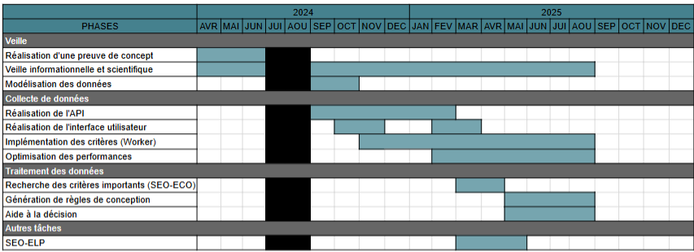
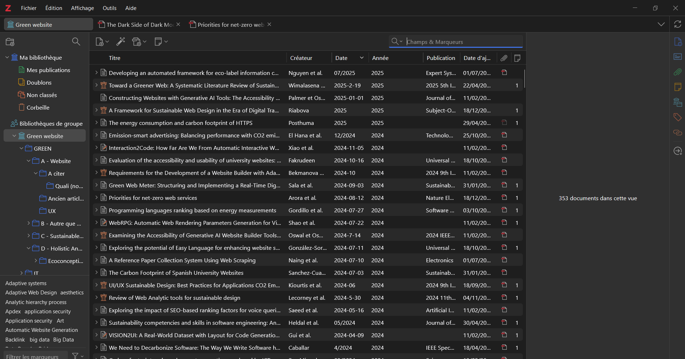

+++
title = "Compétence 6 - Collaborer au sein d'une équipe informatique"
+++

Cette section est dédiée à la présentation du travail réalisé correspondant à la compétence 6 lors de l'alternance à l'ESTA.

## Présentation de la compétence et des apprentissages critiques

Cette compétence se centre autour de la collaboration au sein d'une équipe informatique.

|Composantes|AC 1|AC 2|AC 3|AC 4|
|---|---|---|---|---|
|Identifier ses aptitudes pour travailler dans une équipe|Appréhender l'écosystème numérique|Découvrir les aptitudes requises selon les différents secteurs informatiques|Identifier les statuts, les fonctions et les rôles de chaque membre d'une équipe pluridisciplinaire|Acquérir les compétences interpersonnelles pour travailler en équipe|
|Situer son rôle et ses missions au sein d'une équipe informatique|Comprendre la diversité, la structure et la dimension de l'informatique dans une organisation|Appliquer une démarche pour intégrer une équipe informatique au sein d'une organisation|Mobiliser les compétences interpersonnelles pour intégrer une équipe informatique|Rendre compte de son activité professionnelle|
|Manager une équipe informatique|Organiser et partager une veille numérique|Identifier les enjeux et l'économie de l'innovation numérique|Guider la conduite du changement informatique au sein d'une organisation|Accompagner le management de projet informatique|

## L'informatique au sein de l'ESTA

En préambule de cette section, il est, je pense, intéressant de présenter rapidement l'effectif de l'ESTA. L'ESTA est un établissement du
supérieur composé d'environ 25 membres. La répartition des membres de l'ESTA est la suivante :
- ~10 personnes à l'administration, la gestion et la communication
- 11 enseignants-chercheurs
- 4 doctorants

On constate plusieurs choses en voyant, tout d'abord, l'importance de la partie recherche, et ensuite l'absence d'équipe ou de personnel
informatique. J'ai donc été le seul membre de l'ESTA composant le personnel informatique, ce qui m'a amené à avoir, en plus du projet
décrit dans les compétences [1](/competence1/) et [2](/competence2), des tâches annexes pour le personnel de l'ESTA qui ont consisté à
de la maintenance, du conseil et de l'aide en informatique.

Pour gérer ses besoins en informatique, l'ESTA se repose sur deux prestataires :
- Améos pour le site de l'ESTA
- ITBS pour le réseau et maintenance du matériel informatique

Durant cette alternance, j'ai pu interagir avec les prestataires à différentes reprises. J'ai d'abord pu communiquer avec ITBS concernant
des problèmes réseaux rencontrés à l'ESTA mais aussi concernant des besoins spécifiques liés à la mise en place d'un mini parc de serveurs
à l'ESTA (les serveurs proviennent de mini pc recyclés en serveurs). Mes interactions avec Améos ont été relatives à des problèmes liés
au site de l'ESTA, j'étais présent lors de réunion avec le prestataire et le directeur de la communication de l'ESTA en tant que support
pour donner mon avis et une expertise sur les retours d'Améos concernant les demandes du personnel de l'ESTA.

## L'équipe de recherche de l'ESTA

Durant cette alternance, j'ai été au poste d'assistant recherche dans l'équipe de recherche de l'ESTA. Ce poste m'a permis de communiquer
et de collaborer avec différents chercheurs et doctorants en informatique ou spécialisé dans d'autres disciplines
(finances, info comm, UX/UI, etc.). Mes collaborations avec ces chercheurs ou ces doctorants ont été soit relatives à l'outil qui
représente ma mission principale, soit à des tâches annexes. J'ai pu recevoir l'avis d'un doctorant spécialisé en expérience utilisateur
concernant l'interface de l'outil Holistic Analytica, j'ai pu concevoir de scripts pour aider au formatage des données pour certains
chercheurs.

Le déroulement de mon alternance s'est fait de manière assez agile, même si dans la forme,  ce n'était pas vraiment cas. Mon tuteur,
M. SAGOT, et moi, nous mettions d'accord concernant les tâches à réaliser et leur priorité, je faisais des comptes rendus quasi journalier
de mes avancements, car la communication était un facteur important pour permettre au projet de connaître une évolution dans la bonne
direction. J'étais libre de gérer le projet comme je l'entendais, cependant j'avais besoin de justifier mes choix, en expliquant leur
pertinence, l'impact que cela pourrait avoir sur le projet et les alternatives, si elles existent.

Pour ne pas être totalement perdu, et ne pas faire face à un effet tunnel, mon tuteur et moi avons convenu d'un macro planning
prévisionnel pour avoir une vue d'ensemble des tâches importantes que j'allais devoir réaliser.

|**Illustration 1 : Macro planning prévisionnel**|
|---|

Concernant les phases réellement réalisées lors de cette année, je n'ai pu m'attaquer qu'à trois des grandes phases décrites dans cette
illustration. La phase de veille a été une phase continue, mais je reviendrai sur celle-ci un peu plus tard, la phase de collecte de
données a été la phase de développement la plus conséquente, j'ai dû reprendre le développement d'une application de zéro, j'ai dû
réfléchir aux technologies à employer et justifier mes choix. La phase de traitement n'a pas été réellement commencé, mais je reviendrai
aussi sur celle-ci plus tard, car il y a eu malgré tout des éléments relatifs à celle-ci durant l'alternance. Pour finir, la phase liée à
SEO-ELP a surtout été de la maintenance et un état des lieux de l'application actuel pour déterminer si le projet était maintenable sur
le long terme.

Une des raisons majeures qui a fait que je n'ai pas pu respecter ce planning a été l'étendu du projet et la vision trop optimiste
concernant la difficulté et le temps requis pour certaines tâches. Même si le planning n'a pas pu être totalement respecté dans son
ensemble, sa présence a été nécessaire dans la visualisation de la progression du projet et m'a permis de mieux gérer les différentes
tâches et phases de ce projet.

## L'importance de la veille scientifique et technologique

Pour pouvoir mener à bien ce projet, j'ai dû réfléchir et m'informer concernant les technologies et les architectures logicielles à
employer pour réaliser Holistic Analytica. Cette phase de veille a amené aux choix présentés dans les autres compétences de ce site.
Néanmoins, il est important de noter que cette veille n'a pas que concerner les choix de technologies. Notre outil, cherchant à proposer
des données pertinentes d'un point de vue de la recherche scientifique, se devait de proposer des calculs et des critères les plus proches
possibles de l'existant dans la littérature scientifique.

Pour ce faire, j'ai parcouru une grande quantité d'articles scientifiques pour trouver les critères importants des sujets étudiés
et lorsque cela était possible, j'ai aussi essayé de trouver les méthodes de calcul ou des définitions précises de la représentation
quantitative ou qualitative des critères.

Pour nous permettre de nous partager plus aisément et pour m'épargner une partie initiale de la recherche d'articles, mon tuteur avait mis
en place un dossier Zotero, qu'il a utilisé pour répertorier l'ensemble des articles concernant ses sujets de recherche.

|**Illustration 2 : Capture d'écran du dossier Zotero partagé**|
|---|

L'intérêt de passer par Zotero est que cette application propose plusieurs fonctionnalités permettant l'ajout d'articles et l'utilisation
de leur méta données pour ajouter un ensemble d'informations relatives aux articles ajoutés. Dans notre cas, le dossier que nous avons
utilisé a été principalement alimenté par mon tuteur, qui a ajouté, au fur et à mesure de ses découvertes, les articles correspondant aux
dernières publications dans les domaines de l'éco conception, de la culturalization et du référencement web.

Il a été important de se maintenir à jour concernant ces différents sujets, car l'un des gros problèmes que l'on rencontre lorsque l'on
travaille dans le domaine du développement web est que tout évolue très vite et que beaucoup de choses peuvent changer d'une année à
l'autre. On peut par exemple se rendre compte que certains critères ont en réalité plus d'impact que ce qu'on pourrait initialement penser.
Le fait de se maintenir à jour sur les considérations actuelles du développement dans le domaine de la science, nous a permis de commencer
à envisager l'ajout d'éléments liés à l'accessibilité des pages web que ce soit du point de vue des handicaps ou de l'expérience
utilisateur en général.

## Réunions et échanges concernant mon travail

Durant l'accomplissement de mes tâches, j'ai eu l'opportunité de participer à des réunions, dans lesquelles j'ai pu être actif, concernant
la direction et les possibilités pour l'évolution d'Holistic Analytica et des recherches liées à cet outil. Dans un premier temps, les
points quotidiens avec mon tuteur ont permis de rester centrer sur les objectifs prioritaires ou de les redéfinir en fonction des besoins
et de l'avance du projet. Dans un second temps, les réunions avec mon tuteur et certains autres enseignants-chercheurs de l'ESTA m'ont
permis de comprendre leurs besoins, mais aussi de pouvoir clarifier mes choix concernant le calcul de critères et de pouvoir comprendre
leur point de vue par rapport aux données déjà collectées.

J'ai mentionné plus haut le traitement de données qui n'a pas pu être implémenté durant cette année, néanmoins, j'ai pu avoir de
nombreuses discussions que ce soit avec mon tuteur, avec des chercheurs externes à l'ESTA, mais aussi mon tuteur pédagogique lors des
points de suivi de l'alternance. Ces différents échanges avec des personnes aux spécialisations multiples m'ont permis d'avoir une
idée plus précise de ce qui pourrait être fait pour la partie traitement des données.

## Rendus et comptes rendus

Je n'ai pas forcément laisser de trace écrite concernant la progression de mon travail, cependant, j'ai pu réasliser des synthèses de mes
recherches et de certains spécifications pour aider les personnes qui ont collaboré avec moi à comprendre mes méthodes de calculs, mais
aussi pour leur partager mes découvertes.

Dans les rendus que j'ai pu réaliser, le plus important a été un tableau de synthèse de l'ensemble des critères d'Holistic Analytica.

|**Illustration 3 : Extrait du document de référence des critères d'Holistic Analytica**|
|---|

Dans cet extrait, on peut constater que pour chaque critère, il y a une description, une unité et une explication de la méthode de calcul
de celui-ci (la partie concernant les sources n'a pas été remplie pour tous les critères et est en cours de complétion). L'intérêt de ce
document a été de d'abord me permettre de compiler l'ensemble de mes découvertes et de mes connaissances concernant les critères à
calculer. Ensuite, les données collectées par l'outil Holistic Analytica doivent contribuer à la rédaction de publications scientifiques,
il est donc impératif d'avoir des explications formelles, explicites et exhaustives concernant les critères associés à ces données.

Il y a en tout plus d'une cinquantaine de critères, dont plus de 80% proviennent directement de nos analyses et de nos calculs. Le reste
a été récupéré par le biais d'outils ou d'API externes. Ces critères, qui ne sont pas forcément de notre fait, sont aussi expliqués dans
ce document pour pouvoir laisser une trace de ceux-ci, mais aussi pouvoir les faire comprendre aux différents collaborateurs de recherches
en rapport avec ces données, et surtout de pouvoir mettre au clair ma compréhension et le résultat de mes investigations concernant les
critères obtenus par le biais d'outils externes.

En plus du document de référence, j'ai pu réaliser différents schémas (dont les autres illustrations et traces de ce site), mais aussi
d'autres documents, par exemple un rapport de l'état des lieux du site de l'ESTA, un document compilant des données pour un chercheur en
finance. Cependant une grande partie de ce que j'ai pu faire pour rendre compte de mon activité et de mes avancements, c'est fait par la
voie orale, sans forcément laisser de traces écrites.

## Conclusion

Mon alternance n'a pas été dans le sens strict du terme une expérience au sein d'une équipe informatique, mais plutôt une expérience
au sein d'une équipe scientifique pluridisciplinaire. J'ai malgré tout pu échanger et collaborer avec des personnes dont l'informatique
était le coeur de métier, mais j'ai surtout interagi avec des chercheurs dans le but de savoir comment je pouvais répondre au mieux à
leurs besoins. Les tâches annexes que j'ai pu effectuer pour l'administration de l'ESTA m'ont permis de me rendre compte du problème que
pouvait représenter l'absence d'un service informatique sur site pour l'ESTA. La trop grande dépendance de l'ESTA pour les prestataires
impacte la vitesse de résolution des problèmes d'ordre informatique, les échanges asymétriques diminuent le temps de réponse et mènent
à l'accumulation de petits problèmes (par exemple les tickets pour la résolution de problèmes sur le site de l'ESTA). Le manque d'un
personnel informatique amène aussi à un manque d'expertise métier concernant les prestations commandées par l'ESTA. J'ai donc pu durant
cette alternance tenter d'aider le personnel de l'ESTA concernant différentes questions et problématiques informatiques.
